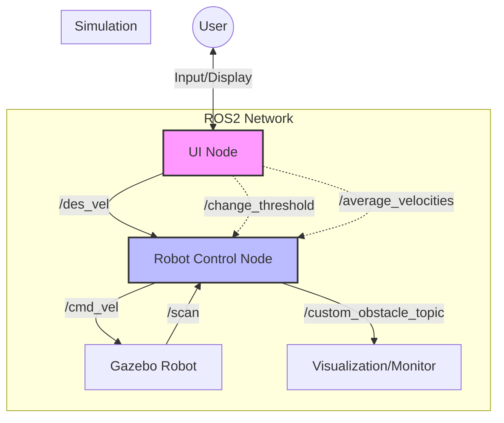

# Assignment 2: Robot Control & UI

A ROS2 package implementing a control system for a differential drive robot with user interface interaction and obstacle avoidance.

## Architecture



## Nodes

### 1. Robot Control Node (`robot_control_node`)
Controls the robot's movement based on user input and sensor data.
- **Subscribes**: `/des_vel` (User target), `/scan` (Laser), `/odom` (Odometry)
- **Publishes**: `/cmd_vel` (Velocity), `/custom_obstacle_topic` (Obstacle info)
- **Services**: 
  - `change_threshold`: Updates the minimum safe distance.
  - `average_velocities`: Returns the average of the last 5 velocity commands.
- **Behavior**: Drives the robot. If an obstacle is detected within `threshold_distance` (default 0.5m), it overrides user input to back up.

### 2. UI Node (`ui_node`)
interactive command-line interface.
- **Controls**:
  - `w`/`s`: Increase/Decrease Linear Velocity
  - `a`/`d`: Increase/Decrease Angular Velocity
  - `x`/Space: Stop
- **Client**: Calls `change_threshold` and `average_velocities` services.

## Simulators
This package uses **Gazebo** for simulation, provided by the `bme_gazebo_sensors` package. The simulation spawns a robot equipped with:
- **Laser Scanner**: Provides distance data for the obstacle avoidance logic.
- **Odometry**: Provides position and orientation data.

## Installation & Running

1. **Build the package**:
   ```bash
   colcon build --packages-select assignment2_rt assignment2_custom_msgs_srvs bme_gazebo_sensors
   source install/setup.bash
   ```

2. **Run Everything (Simulation + Assignment)**:
   The easiest way to run the assignment is using the combined launch file:
   ```bash
   ros2 launch assignment2_rt all.launch.py
   ```
   *This will launch Gazebo, the Robot Control node, and the UI node (in a separate terminal).*

3. **(Alternative) Run Separately**:
   If you prefer to run components individually:

   **Terminal 1 (Simulation):**
   ```bash
   ros2 launch bme_gazebo_sensors spawn_robot.launch.py
   ```

   **Terminal 2 (Launch Assignment Nodes):**
   ```bash
   ros2 launch assignment2_rt assignment2.launch.py
   ```
